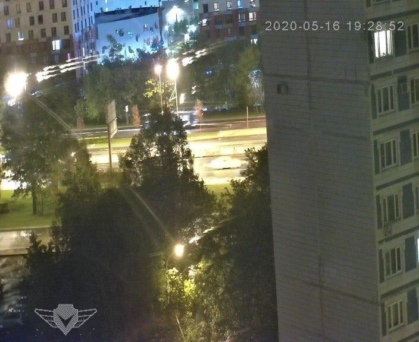
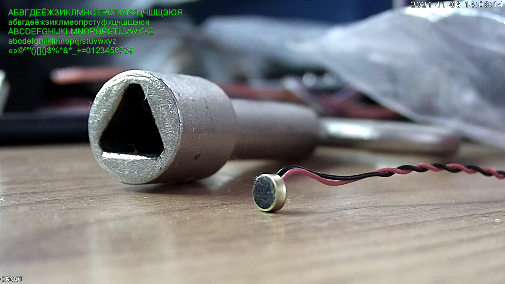

# python-dvr

Python library for configuring a wide range of IP cameras that use the NETsurveillance ActiveX plugin
XMeye SDK


## DeviceManager.py

DeviceManager.py is a standalone Tkinter and console interface program such as the original DeviceManager.exe
it possible to work on both systems, if there is no Tkinter it starts with a console interface

## DVR-IP, NetSurveillance or "Sofia" Protocol

The NETSurveillance ActiveX plugin uses a TCP based protocol referred to simply as the "Digital Video Recorder Interface Protocol" by the "Hangzhou male Mai Information Co".

There is very little software support or documentation other than through tools provided by the manufacturers of these cameras, which leaves many configuration options inaccessible.

- [Command and response codes](https://gist.github.com/ekwoodrich/a6d7b8db8f82adf107c3c366e61fd36f)

- [Xiongmai DVR API v1.0, Russian](https://github.com/OpenIPC/python-dvr/blob/master/doc/Соглашение%20о%20интерфейсе%20цифрового%20видеорегистратора%20XiongmaiV1.0.doc)

- [Xiongmai DVR API, 2013-01-11, Chinese](doc/雄迈数字视频录像机接口协议_V1.0.0.pdf)

- [DVR API, brief description, Chinese](doc/配置交换格式V2.0.pdf)

- [NETIP video/audio payload protocol, Chinese](doc/码流帧格式文档.pdf)

### Similar projects

- [sofiactl](https://github.com/667bdrm/sofiactl)

- [DVRIP library and tools](https://github.com/alexshpilkin/dvrip)

- [numenworld-ipcam](https://github.com/johndoe31415/numenworld-ipcam)

### Server implementations

* [OpenIPC](https://openipc.org/firmware/)

## Basic usage

```python
from dvrip import DVRIPCam
from time import sleep

host_ip = '192.168.1.10'

cam = DVRIPCam(host_ip, user='admin', password='')
if cam.login():
	print("Success! Connected to " + host_ip)
else:
	print("Failure. Could not connect.")

print("Camera time:", cam.get_time())

# Reboot camera
cam.reboot()
sleep(60) # wait while camera starts

# Login again
cam.login()
# Sync camera time with PC time
cam.set_time()
# Disconnect
cam.close()
```

## AsyncIO usage
```python
from asyncio_dvrip import DVRIPCam
import asyncio
import traceback

def stop(loop):
  tasks = asyncio.gather(*asyncio.Task.all_tasks(loop=loop), loop=loop, return_exceptions=True)
  tasks.add_done_callback(lambda t: loop.stop())
  tasks.cancel()

loop = asyncio.get_event_loop()

def onAlert(event, sequence_number):
  print(event, sequence_number)

async def some_test_worker():
  while True:
    print("do some important work...")

    await asyncio.sleep(3)

async def main(loop):
  host_ip = '192.168.1.10'
  cam = DVRIPCam(host_ip, user='admin', password='')
  try:
    if not await cam.login():
      raise Exception("Failure. Could not connect.")

    # -------------------------------

    # take snapshot
    image = await cam.snapshot()
    # save it
    with open("snap.jpeg", "wb") as fp:
      fp.write(image)

    # -------------------------------

    # write video
    with open("datastream.h265", "wb") as f:
      await cam.start_monitor(lambda frame, meta, user: f.write(frame))

    # -------------------------------

    # or get alarms
    cam.setAlarm(onAlert)
    # will create new task
    await cam.alarmStart(loop)

    # so just wait or something else
    while True:
      await asyncio.sleep(1)

    # -------------------------------

  except:
    pass
  finally:
    cam.close()

try:
  loop.create_task(main(loop))
  loop.create_task(some_test_worker())

  loop.run_forever()
except Exception as err:
  msg = ''.join(traceback.format_tb(err.__traceback__) + [str(err)])
  print(msg)
finally:
  cam.close()
  stop(loop)
```

## Camera settings

```python
params = cam.get_general_info()
```

Returns general camera information (timezones, formats, auto reboot policy,
security options):

```json
{
  "AppBindFlag": {
    "BeBinded": false
  },
  "AutoMaintain": {
    "AutoDeleteFilesDays": 0,
    "AutoRebootDay": "Tuesday",
    "AutoRebootHour": 3
  },
  "DSTState": {
    "InNormalState": true
  },
  "General": {
    "AutoLogout": 0,
    "FontSize": 24,
    "IranCalendarEnable": 0,
    "LocalNo": 0,
    "MachineName": "LocalHost",
    "OverWrite": "OverWrite",
    "ScreenAutoShutdown": 10,
    "ScreenSaveTime": 0,
    "VideoOutPut": "Auto"
  },
  "Location": {
    "DSTEnd": {
      "Day": 1,
      "Hour": 1,
      "Minute": 1,
      "Month": 10,
      "Week": 0,
      "Year": 2021
    },
    "DSTRule": "Off",
    "DSTStart": {
      "Day": 1,
      "Hour": 1,
      "Minute": 1,
      "Month": 5,
      "Week": 0,
      "Year": 2021
    },
    "DateFormat": "YYMMDD",
    "DateSeparator": "-",
    "IranCalendar": 0,
    "Language": "Russian",
    "TimeFormat": "24",
    "VideoFormat": "PAL",
    "Week": null,
    "WorkDay": 62
  },
  "OneKeyMaskVideo": null,
  "PwdSafety": {
    "PwdReset": [
      {
        "QuestionAnswer": "",
        "QuestionIndex": 0
      },
      {
        "QuestionAnswer": "",
        "QuestionIndex": 0
      },
      {
        "QuestionAnswer": "",
        "QuestionIndex": 0
      },
      {
        "QuestionAnswer": "",
        "QuestionIndex": 0
      }
    ],
    "SecurityEmail": "",
    "TipPageHide": false
  },
  "ResumePtzState": null,
  "TimingSleep": null
}
```

```python
params = cam.get_system_info()
```

Returns hardware specific settings, camera serial number, current software
version and firmware type:

```json
{
  "AlarmInChannel": 2,
  "AlarmOutChannel": 1,
  "AudioInChannel": 1,
  "BuildTime": "2020-01-08 11:05:18",
  "CombineSwitch": 0,
  "DeviceModel": "HI3516EV300_85H50AI",
  "DeviceRunTime": "0x0001f532",
  "DigChannel": 0,
  "EncryptVersion": "Unknown",
  "ExtraChannel": 0,
  "HardWare": "HI3516EV300_85H50AI",
  "HardWareVersion": "Unknown",
  "SerialNo": "a166379674a3b447",
  "SoftWareVersion": "V5.00.R02.000529B2.10010.040600.0020000",
  "TalkInChannel": 1,
  "TalkOutChannel": 1,
  "UpdataTime": "",
  "UpdataType": "0x00000000",
  "VideoInChannel": 1,
  "VideoOutChannel": 1
}
```

```python
params = cam.get_system_capabilities()
```

Returns capabilities for the camera software (alarms and detection,
communication protocols and hardware specific features):

```json
{
  "AlarmFunction": {
    "AlarmConfig": true,
    "BlindDetect": true,
    "HumanDection": true,
    "HumanPedDetection": true,
    "LossDetect": true,
    "MotionDetect": true,
    "NetAbort": true,
    "NetAlarm": true,
    "NetIpConflict": true,
    "NewVideoAnalyze": false,
    "PEAInHumanPed": true,
    "StorageFailure": true,
    "StorageLowSpace": true,
    "StorageNotExist": true,
    "VideoAnalyze": false
  },
  "CommFunction": {
    "CommRS232": true,
    "CommRS485": true
  },
  "EncodeFunction": {
    "DoubleStream": true,
    "SmartH264": true,
    "SmartH264V2": false,
    "SnapStream": true
  },
  "NetServerFunction": {
    "IPAdaptive": true,
    "Net3G": false,
    "Net4GSignalLevel": false,
    "NetAlarmCenter": true,
    "NetDAS": false,
    "NetDDNS": false,
    "NetDHCP": true,
    "NetDNS": true,
    "NetEmail": true,
    "NetFTP": true,
    "NetIPFilter": true,
    "NetMutlicast": false,
    "NetNTP": true,
    "NetNat": true,
    "NetPMS": true,
    "NetPMSV2": true,
    "NetPPPoE": false,
    "NetRTSP": true,
    "NetSPVMN": false,
    "NetUPNP": true,
    "NetWifi": false,
    "OnvifPwdCheckout": true,
    "RTMP": false,
    "WifiModeSwitch": false,
    "WifiRouteSignalLevel": true
  },
  "OtherFunction": {
    "NOHDDRECORD": false,
    "NoSupportSafetyQuestion": false,
    "NotSupportAutoAndIntelligent": false,
    "SupportAdminContactInfo": true,
    "SupportAlarmRemoteCall": false,
    "SupportAlarmVoiceTipInterval": true,
    "SupportAlarmVoiceTips": true,
    "SupportAlarmVoiceTipsType": true,
    "SupportAppBindFlag": true,
    "SupportBT": true,
    "SupportBallTelescopic": false,
    "SupportBoxCameraBulb": false,
    "SupportCamareStyle": true,
    "SupportCameraWhiteLight": false,
    "SupportCfgCloudupgrade": true,
    "SupportChangeLanguageNoReboot": true,
    "SupportCloseVoiceTip": false,
    "SupportCloudUpgrade": true,
    "SupportCommDataUpload": true,
    "SupportCorridorMode": false,
    "SupportCustomizeLpRect": false,
    "SupportDNChangeByImage": false,
    "SupportDimenCode": true,
    "SupportDoubleLightBoxCamera": false,
    "SupportDoubleLightBulb": false,
    "SupportElectronicPTZ": false,
    "SupportFTPTest": true,
    "SupportFaceDetectV2": false,
    "SupportFaceRecognition": false,
    "SupportMailTest": true,
    "SupportMusicBulb433Pair": false,
    "SupportMusicLightBulb": false,
    "SupportNetWorkMode": false,
    "SupportOSDInfo": false,
    "SupportOneKeyMaskVideo": false,
    "SupportPCSetDoubleLight": true,
    "SupportPTZDirectionControl": false,
    "SupportPTZTour": false,
    "SupportPWDSafety": true,
    "SupportParkingGuide": false,
    "SupportPtz360Spin": false,
    "SupportRPSVideo": false,
    "SupportSetBrightness": false,
    "SupportSetDetectTrackWatchPoint": false,
    "SupportSetHardwareAbility": false,
    "SupportSetPTZPresetAttribute": false,
    "SupportSetVolume": true,
    "SupportShowH265X": true,
    "SupportSnapCfg": false,
    "SupportSnapV2Stream": true,
    "SupportSnapshotConfigV2": false,
    "SupportSoftPhotosensitive": true,
    "SupportStatusLed": false,
    "SupportTextPassword": true,
    "SupportTimeZone": true,
    "SupportTimingSleep": false,
    "SupportWebRTCModule": false,
    "SupportWriteLog": true,
    "SuppportChangeOnvifPort": true
  },
  "PreviewFunction": {
    "Talk": true,
    "Tour": false
  },
  "TipShow": {
    "NoBeepTipShow": true
  }
}
```

## Camera video settings/modes

```python
params = cam.get_info("Camera")
# Returns data like this:
# {'ClearFog': [{'enable': 0, 'level': 50}], 'DistortionCorrect': {'Lenstype': 0, 'Version': 0},
# 'FishLensParam': [{'CenterOffsetX': 300, 'CenterOffsetY': 300, 'ImageHeight': 720,
# 'ImageWidth': 1280, 'LensType': 0, 'PCMac': '000000000000', 'Radius': 300, 'Version': 1,
# 'ViewAngle': 0, 'ViewMode': 0, 'Zoom': 100}], 'FishViCut': [{'ImgHeight': 0, 'ImgWidth': 0,
# 'Xoffset': 0, 'Yoffset': 0}], 'Param': [{'AeSensitivity': 5, 'ApertureMode': '0x00000000',
# 'BLCMode': '0x00000000', 'DayNightColor': '0x00000000', 'Day_nfLevel': 3, 'DncThr': 30,
# 'ElecLevel': 50, 'EsShutter': '0x00000002', 'ExposureParam': {'LeastTime': '0x00000100',
# 'Level': 0, 'MostTime': '0x00010000'}, 'GainParam': {'AutoGain': 1, 'Gain': 50},
# 'IRCUTMode': 0, 'IrcutSwap': 0, 'Night_nfLevel': 3, 'PictureFlip': '0x00000000',
# 'PictureMirror': '0x00000000', 'RejectFlicker': '0x00000000', 'WhiteBalance': '0x00000000'}],
# 'ParamEx': [{'AutomaticAdjustment': 3, 'BroadTrends': {'AutoGain': 0, 'Gain': 50},
# 'CorridorMode': 0, 'ExposureTime': '0x100', 'LightRestrainLevel': 16, 'LowLuxMode': 0,
# 'PreventOverExpo': 0, 'SoftPhotosensitivecontrol': 0, 'Style': 'type1'}], 'WhiteLight':
# {'MoveTrigLight': {'Duration': 60, 'Level': 3}, 'WorkMode': 'Auto', 'WorkPeriod':
# {'EHour': 6, 'EMinute': 0, 'Enable': 1, 'SHour': 18, 'SMinute': 0}}}

# Get current encoding settings
enc_info = cam.get_info("Simplify.Encode")
# Returns data like this:
# [{'ExtraFormat': {'AudioEnable': False, 'Video': {'BitRate': 552, 'BitRateControl': 'VBR',
# 'Compression': 'H.265', 'FPS': 20, 'GOP': 2, 'Quality': 3, 'Resolution': 'D1'},
# 'VideoEnable': True}, 'MainFormat': {'AudioEnable': False, 'Video': {'BitRate': 2662,
# 'BitRateControl': 'VBR', 'Compression': 'H.265', 'FPS': 25, 'GOP': 2, 'Quality': 4,
# 'Resolution': '1080P'}, 'VideoEnable': True}}]

# Change bitrate
NewBitrate = 7000
enc_info[0]['MainFormat']['Video']['BitRate'] = NewBitrate
cam.set_info("Simplify.Encode", enc_info)

# Get videochannel color parameters
colors = cam.get_info("AVEnc.VideoColor.[0]")
# Returns data like this:
# [{'Enable': True, 'TimeSection': '0 00:00:00-24:00:00', 'VideoColorParam': {'Acutance': 3848,
# 'Brightness': 50, 'Contrast': 50, 'Gain': 0, 'Hue': 50, 'Saturation': 50, 'Whitebalance': 128}},
# {'Enable': False, 'TimeSection': '0 00:00:00-24:00:00', 'VideoColorParam': {'Acutance': 3848,
# 'Brightness': 50, 'Contrast': 50, 'Gain': 0, 'Hue': 50, 'Saturation': 50, 'Whitebalance': 128}}]

# Change IR Cut
cam.set_info("Camera.Param.[0]", { "IrcutSwap" : 0 })

# Change WDR settings
WDR_mode = True
cam.set_info("Camera.ParamEx.[0]", { "BroadTrends" : { "AutoGain" : int(WDR_mode) } })

# Get network settings
net = cam.get_info("NetWork.NetCommon")
# Turn on adaptive IP mode
cam.set_info("NetWork.IPAdaptive", { "IPAdaptive": True })
# Set camera hostname
cam.set_info("NetWork.NetCommon.HostName", "IVG-85HG50PYA-S")
# Set DHCP mode (turn on in this case)
dhcpst = cam.get_info("NetWork.NetDHCP")
dhcpst[0]['Enable'] = True
cam.set_info("NetWork.NetDHCP", dhcpst)

# Enable/disable cloud support
cloudEnabled = False
cam.set_info("NetWork.Nat", { "NatEnable" : cloudEnabled })
```

## Add user and change password

```python
#User "test2" with pssword "123123"
cam.addUser("test2","123123")
#Bad password, change it
cam.changePasswd("321321",cam.sofia_hash("123123"),"test2")
#And delete user "test2"
if cam.delUser("test2"):
    print("User deleted")
else:
    print("Can not delete it")
#System users can not be deleted
if cam.delUser("admin"):
    print("You do it! How?")
else:
    print("It system reserved user")
```

## Investigate more settings

Suggested approach will help understand connections between camera UI and API
settings. Fell free to send PR to the document to update information.

```python
from deepdiff import DeepDiff
from pprint import pprint

latest = None
while True:
    current = cam.get_info("Camera") # or "General", "Simplify.Encode", "NetWork"
    if latest:
        diff = DeepDiff(current, latest)
        if diff == {}:
            print("Nothing changed")
        else:
            pprint(diff['values_changed'], indent = 2)
    latest = current
    input("Change camera setting via UI and then press Enter,"
          " or double Ctrl-C to exit\n")
```

## Get JPEG snapshot

```python
with open("snap.jpg", "wb") as f:
    f.write(cam.snapshot())
```

## Get video/audio bitstream

Video-only writing to file (using simple lambda):

```python
with open("datastream.h265", "wb") as f:
    cam.start_monitor(lambda frame, meta, user: f.write(frame))
```

Writing datastream with additional filtering (capture first 100 frames):

```python
class State:
    def __init__(self):
        self.counter = 0

    def count(self):
        return self.counter

    def inc(self):
        self.counter += 1

with open("datastream.h265", "wb") as f:
    state = State()
    def receiver(frame, meta, state):
        if 'frame' in meta:
            f.write(frame)
            state.inc()
            print(state.count())
            if state.count() == 100:
                cam.stop_monitor()

    cam.start_monitor(receiver, state)
```

## Set camera title

```python
# Simple way to change picture title
cam.channel_title(["Backyard"])

# Use unicode font from host computer to compose bitmap for title
from PIL import Image, ImageDraw, ImageFont

w_disp   = 128
h_disp   =  64
fontsize =  32
text     =  "Туалет"

imageRGB = Image.new('RGB', (w_disp, h_disp))
draw  = ImageDraw.Draw(imageRGB)
font  = ImageFont.truetype("/Library/Fonts/Arial Unicode.ttf", fontsize)
w, h  = draw.textsize(text, font=font)
draw.text(((w_disp - w)/2, (h_disp - h)/2), text, font=font)
image1bit = imageRGB.convert("1")
data = image1bit.tobytes()
cam.channel_bitmap(w_disp, h_disp, data)

# Use your own logo on picture
img = Image.open('vixand.png')
width, height = img.size
data = img.convert("1").tobytes()
cam.channel_bitmap(width, height, data)
```



```sh
# Show current temperature, velocity, GPS coordinates, etc
# Use the same method to draw text to bitmap and transmit it to camera
# but consider place internal bitmap storage to RAM:
mount -t tmpfs -o size=100k tmpfs /mnt/mtd/tmpfs
ln -sf /mnt/mtd/tmpfs/0.dot /mnt/mtd/Config/Dot/0.dot
```

## OSD special text displaying

```python
cam.set_info("fVideo.OSDInfo", {"Align": 2, "OSDInfo": [
    {
        "Info": [
            "АБВГДЕЁЖЗИКЛМНОПРСТУФХЦЧШЩЭЮЯ",
            "абвгдеёжзиклмеопрстуфхцчшщэюя",
            "ABCDEFGHIJKLMNOPQRSTUVWXYZ",
            "abcdefghijklmnopqrstuvwxyz",
            "«»©°\"'()[]{}$%^&*_+=0123456789"
        ],
        "OSDInfoWidget": {
            "BackColor": "0x00000000",
            "EncodeBlend": True,
            "FrontColor": "0xD000FF00",
            "PreviewBlend": True,
            "RelativePos": [20, 50, 0, 0]
        }
    }
], "strEnc": "UTF-8"})
```



## Upgrade camera firmware

```python
# Optional: get information about upgrade parameters
print(cam.get_upgrade_info())

# Do upgrade
cam.upgrade("General_HZXM_IPC_HI3516CV300_50H20L_AE_S38_V4.03.R12.Nat.OnvifS.HIK.20181126_ALL.bin")
```

## Monitor Script

This script will persistently attempt to connect to camera at `CAMERA_IP`, will create a directory named `CAMERA_NAME` in `FILE_PATH` and start writing separate video and audio streams in files chunked in 10-minute clips, arranged in folders structured as `%Y/%m/%d`. It will also log what it does.

```sh
./monitor.py <CAMERA_IP> <CAMERA_NAME> <FILE_PATH>
```

## OPFeederFunctions

These functions are to handle the pet food dispenser when available.
You can see it with :

```python
>>> cam.get_system_capabilities()['OtherFunction']['SupportFeederFunction']
True
```

<details>
  <summary>OPFeedManual</summary>
  
  ```python
  >>> cam.set_command("OPFeedManual", {"Servings": 1})
  {'Name': 'OPFeedManual', 'OPFeedManual': {'Feeded': 1, 'NotFeeding': 0}, 'Ret': 100, 'SessionID': '0x38'}
  ```
  
  Servings is the number of portions

</details>

<details>
  <summary>OPFeedBook</summary>
  
  ```python
  >>> cam.get_command("OPFeedBook")
  {'FeedBook': [{'Enable': 1, 'RecDate': '2018-04-01', 'RecTime': '12:19:18', 'Servings': 1, 'Time': '03:00:00'}, {'Enable': 1, 'RecDate': '2018-04-01', 'RecTime': '12:19:18', 'Servings': 1, 'Time': '09:00:00'}, {'Enable': 1, 'RecDate': '2018-04-01', 'RecTime': '12:19:18', 'Servings': 1, 'Time': '06:00:00'}, {'Enable': 1, 'RecDate': '2018-04-01', 'RecTime': '12:19:18', 'Servings': 1, 'Time': '15:00:00'}, {'Enable': 1, 'RecDate': '2018-04-01', 'RecTime': '12:19:18', 'Servings': 1, 'Time': '12:00:00'}, {'Enable': 1, 'RecDate': '2018-04-01', 'RecTime': '12:19:18', 'Servings': 1, 'Time': '21:00:00'}, {'Enable': 1, 'RecDate': '2018-04-01', 'RecTime': '12:19:18', 'Servings': 1, 'Time': '18:00:00'}, {'Enable': 1, 'RecDate': '2018-04-01', 'RecTime': '12:19:18', 'Servings': 1, 'Time': '00:00:00'}, {'Enable': 1, 'RecDate': '2018-04-01', 'RecTime': '12:19:18', 'Servings': 5, 'Time': '01:00:00'}]}
  ```

  ```python
  >>> cam.set_command("OPFeedBook", {"Action": "Delete", "FeedBook": [{'Enable': 1, 'RecDate': '2018-04-01', 'RecTime': '12:19:18', 'Servings': 5, 'Time': '01:00:00'}]})
  {'Name': 'OPFeedBook', 'Ret': 100, 'SessionID': '0x00000018'}
  ```

  ```python
  >>> cam.set_command("OPFeedBook", {"Action": "Add", "FeedBook": [{'Enable': 1, 'RecDate': '2018-04-01', 'RecTime': '12:19:18', 'Servings': 5, 'Time': '01:00:00'}]})
  {'Name': 'OPFeedBook', 'Ret': 100, 'SessionID': '0x00000018'}
  ```

</details>

<details>
  <summary>OPFeedHistory</summary>
  
  ```python
  >>> cam.get_command("OPFeedHistory")
  {'FeedHistory': [{'Date': '2022-08-29', 'Servings': 1, 'Time': '18:49:45', 'Type': 2}, {'Date': '2022-08-26', 'Servings': 3, 'Time': '07:30:12', 'Type': 1}]}
  ```
  
  Type 1 : automatic

  Type 2 : manual

  ```python
  >>> cam.set_command("OPFeedHistory", {"Action": "Delete", "FeedHistory": [{'Date': '2022-08-29', 'Servings': 1, 'Time': '19:40:01', 'Type': 2}]})
  {'Name': 'OPFeedHistory', 'Ret': 100, 'SessionID': '0x00000027'}
  ```

</details>

## Troubleshooting

```python
cam.debug()
# or to enable non-standard format
cam.debug('%(asctime)s - %(name)s - %(levelname)s - %(message)s')
```

## Acknowledgements

_Telnet access creds from gabonator_

https://gist.github.com/gabonator/74cdd6ab4f733ff047356198c781f27d
